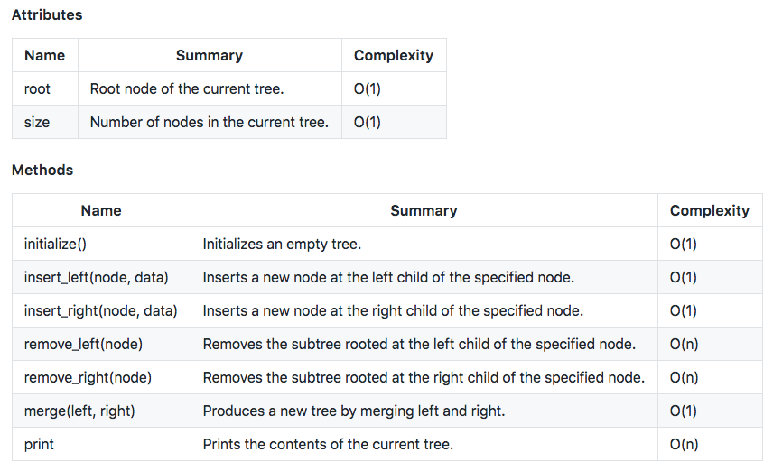

# Binary Tree

BST

- Value of the node must be `greater than (or equal to)` any values stored in the left side of subtree.
- Value of the node must be `less than (or equal to)` any values stored in the right side of the subtree.

BST can be traversed

- preorder 
- inorder 
- postorder 
- level-order


All Depth first parsings are 0(N) for both space and time.


#### Tree structure and level order insertion

```ruby
class TreeNode
     attr_accessor :val, :left, :right
     def initialize(val = 0, left = nil, right = nil)
         @val = val
         @left = left
         @right = right
     end
end
```

You can ingest level order tree 

```ruby
def level_order_input_insert(arr)
   root = TreeNode.new(arr[0]) 
   helper([root],arr,1) 
   return root 
end

def helper(nodes,arr,ptr)
    next_nodes=[]
    return if arr.length == ptr    
    while nodes.length != 0 do
        n = nodes.shift
        n.left = TreeNode.new(arr[ptr])
        ptr +=1
        return if arr.length == ptr    
        
        n.right = TreeNode.new(arr[ptr])
        ptr +=1
        next_nodes.push(n.left,n.right)
        return if arr.length == ptr    
    end    
    helper(next_nodes,arr,ptr)
end

a = [1, 2, 3, 4, 5, 6]
root = level_order_input_insert(a)


```

Output  same tree in the level order fashion 

```ruby
def level_order(root)
    return [] if root.nil?
    traverse([root],[]).flatten  
end

def traverse(nodes, results)
  return results if nodes.empty?  
  results << nodes.map{ |n| n.val }
  next_level_nodes = nodes.map{ |n| [n.left, n.right]}.flatten.compact 
  traverse(next_level_nodes,results)  
end

```

#### Leedcode glue
Glue code which LC provides for the binary tree

```ruby
#!/usr/bin/env ruby
#

class TreeNode
     attr_accessor :val, :left, :right
     def initialize(val = 0, left = nil, right = nil)
         @val = val
         @left = left
         @right = right
     end
end


# push function
def pushNode(node, val)
    return if val.nil?
    if(val > node.val)
     if(node.right)
      pushNode(node.right, val)
     else
      node.right = TreeNode.new(val)
     end
    else
     if(node.left)
      pushNode(node.left, val)
     else
      node.left = TreeNode.new(val)
     end
    end
end

# traverse functions
def postorder_traversal(root)
        return [] if root.nil?
        return postorder_traversal(root.left) +
               postorder_traversal(root.right) +
               [root.val]
end


def preorder_traversal(root)
    return [] if root.nil?
    return [root.val] +
           preorder_traversal(root.left) +
           preorder_traversal(root.right)
end


def inorder_traversal(root)
        return [] if root.nil?
        return inorder_traversal(root.left) +
               [root.val]  +
               inorder_traversal(root.right)
end


# your leetcode input
#arr = [5,6,2,4,1,8,7,9,3];
arr = [5,1,4,nil,nil,3,6]


root = TreeNode.new(arr.shift);
arr.each{|e| pushNode(root, e) }


p postorder_traversal(root)
p inorder_traversal(root)
p preorder_traversal(root)
```


#### Other Depth first traversing

- Post

  ```ruby
  def dfs_post(root)
      return [] if root.nil?
      
      return  dfs_post(root.left) + 
              dfs_post(root.right) +
              [ root.val ]
  end
  ```

- Pre

  ```ruby
  def dfs_pre(root)
    return [] if root.nil?
  
    return [ root.val ] +
           dfs_pre(root.left) +
           dfs_pre(root.right)   
  end
  ```

- Inorder

  ```ruby
  def dfs_in(root)
    return [] if root.nil?
  
    return dfs_in(root.left) +
           [ root.val ] +
           dfs_in(root.right)   
  end
  ```

  


#### Max depth 

```ruby
def max_depth(root)
        return 0 if root.nil?
        left = max_depth(root.left)
        right = max_depth(root.right)
        return left > right ? left + 1 : right + 1
end
```


#### Is symmetric

```ruby
def is_symmetric(root)
    return true if root.nil?
    helper(root.left,root.right) 
end


def helper(left,right)
    
    return true if left.nil? && right.nil?
    return false if left.nil? || right.nil?
    
    return left.val == right.val && helper(left.left,right.right) && helper(right.left, left.right)
    
end
```


#### Path sum

```ruby
def has_path_sum(root, sum)
    helper(root,[],sum)
end


def helper(node, path=[],sum)
    
   if node.nil? 
    s = 0
    path.each{ |n| s += n }
    s == sum ? ( return true ) : ( return false )
   elsif node.left.nil?
    path << node.val 
    return helper(node.right,path.clone,sum)
   elsif node.right.nil?
    path << node.val 
    return helper(node.left,path.clone,sum)
   else
    path << node.val 
    return helper(node.left,path.clone,sum) || helper(node.right,path.clone,sum)
   end
    
end
```





# Tree traverse

```ruby
#!/usr/bin/env ruby

require 'pp'

input=[
    [1,2,3,4],    
    [5,6,7,8],    
    [9,10,11,12]    
]

def explore(x,y,grid)
    
    x_max = grid[0].length - 1 
    y_max = grid.length - 1
    
    # co
    puts grid[y][x]
   
    neigh = []
    
  
  # While implementing DFS you have to have 
  # - seen  (this will do recursion depth tracking)
  # - track (this will track end results)
    if x+1 <= x_max 
       neigh.push(grid[y][x+1]) 
    end

    if x-1 >= 0
       neigh.push(grid[y][x-1]) 
    end
    
    if y+1 <= y_max 
       neigh.push(grid[y+1][x]) 
    end

    if y-1 >= 0
       neigh.push(grid[y-1][x]) 
    end

  
  
  
    return neigh

end


def dfs(input)
    x_max = input[0].length - 1 
    y_max = input.length - 1

    (0..y_max).each do |y| 
        (0..x_max).each do |x|
            pp explore(x,y,input)
        end 
    end
end

dfs(input)
```


```ruby
#!/usr/bin/env ruby


input=[[1,0,2,0,1],[0,0,0,0,0],[0,0,1,0,0]]

def dfs(grid)

end

def explore(x,y,grid,step_cnt,tracker)
    return if tracker.keys.length == 3   
    
    x_max =  grid[0].length - 1
    y_max =  grid.length - 1
    
    
    if x+1 < x_max
        puts grid[2][0]

        if grid[x+1][y] == 0
            step_cnt += 1
            explore(x+1,y,grid,step_cnt,tracker) 
        elsif grid[x+1][y] == 1
           key = "#{x+1}-#{y}"
           tracker[key] = step_cnt + 1
           return 
        end
    end
    
    if x-1 > 0
        if grid[x-1][y] == 0
            step_cnt += 1
            explore(x-1,y,grid,step_cnt,tracker) 
        elsif grid[x+1][y] == 1
           key = "#{x-1}-#{y}"
           tracker[key] = step_cnt + 1
           return 
        end
    end
    

    if y+1 < y_max
        if grid[x][y+1] == 0
            step_cnt += 1
            explore(x,y+1,grid,step_cnt,tracker) 
        elsif grid[x][y+1] == 1
           key = "#{x}-#{y+1}"
           tracker[key] = step_cnt + 1
           return 
        end
    end
    
    if y-1 > 0
        if grid[x][y-1] == 0
            step_cnt += 1
            explore(x,y-1,grid,step_cnt,tracker) 
        elsif grid[x][y-1] == 1
           key = "#{x}-#{y-1}"
           tracker[key] = step_cnt + 1
           return 
        end
    end
    
    return
     
end

tracker = {}

explore(1,0,input,0,tracker)

p tracker
```

#### combination of paths
If you want to bubble up the value from the base case.

```ruby
def matrix(x,y)
    
max_x = 7
max_y = 3

    if x == max_x && y == max_y
        return 1
    end
    
    xx = yy = 0
    
    if x+1 <= max_x
        xx = matrix(x+1,y) 
    end
    
    if y+1 <= max_y
        yy = matrix(x,y+1) || 0
    end
    
    return xx + yy 
end

p matrix(1,1)
```
