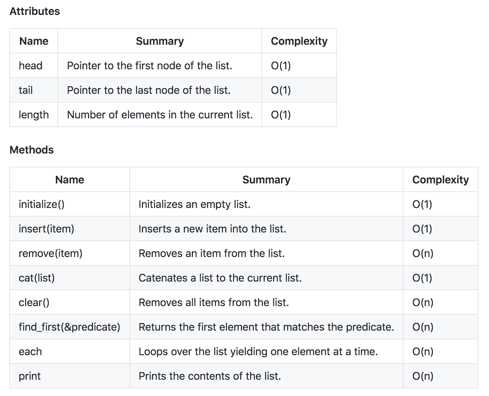

# Data structures - Linked list

Single linked list

When to use singly linked list.

- Sequences are small.
- Sequences are significant, but you don’t care about lookup times.
- You can sacrifice read performance for the sake of optimal writes (inserts).
- You can afford to walk the list from head to tail, only.

Doubly linked list 

- And last but not least, since removals are O(1), doubly linked lists could be a good choice for those cases where you have to handle lots of delete operations.
- Doubly linked lists work great when you have to move back and forth over a (small) sequence of elements without wraparound.

